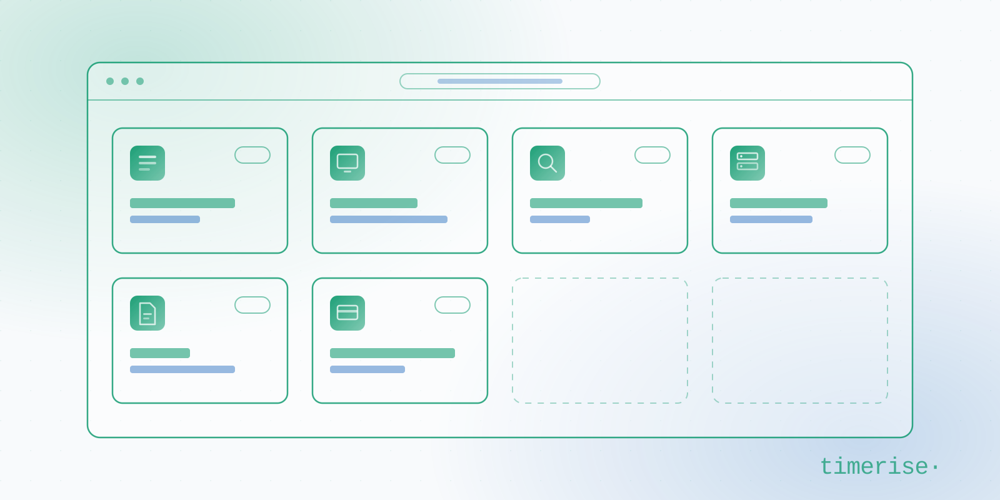

# Timerise Skills



[](https://agentskills.io)
[](https://www.skills.sh)
[](https://docs.claude.com/en/docs/claude-code/skills)
[](https://developers.openai.com/codex/skills)
[](https://github.com/google-gemini/gemini-cli/blob/main/docs/cli/skills.md)

The index of [Agent Skills](https://agentskills.io) published by [Timerise](https://timerise.ai). Each skill
is a self-contained repository that teaches an agent to build one production-grade module for a
**Next.js App Router** app, on the customer's own stack, the way our engineers build it after shipping it
many times. Agent Skills is an open format, so the same folder works in Claude Code, Codex CLI, Gemini CLI and
the other skills-compatible agents.

The skills are how we build the standard modules of every custom booking system we deliver. They are written
by our own senior engineers from six years of building booking systems: each one is a member of the team's
own way of building a module they have shipped many times, written down, with the properties it has to hold
stated as what the build and the tests verify. None of it is synthetic: no skill was generated by a model from a prompt. They are
published so the code you receive from us is built on parts you can read, and so anyone running a
skills-compatible agent can build on the same parts.

## Skills

| Skill | Version | Builds | Backend |
|---|---|---|---|
| [`ad-campaign-runbook`](https://github.com/timerise-ai/ad-campaign-runbook) | 0.1.0 | LinkedIn Ads campaign runbook for one blog post: a probe of what the site actually measures, a campaign structure sized by the budget and the platform minimum, ad copy traceable to the post, an organic companion post with author-only slots, UTMs, conversions and click-by-click Campaign Manager steps | No data store, markdown posts in the repository; analytics vendor and consent component behind a seam |
| [`blog-markdown`](https://github.com/timerise-ai/blog-markdown) | 0.1.6 | File-based multilingual blog with localized slugs, tag pages, related posts, RSS, sitemap, hreflang and a CI content validator | Repository files, no CMS |
| [`bookable-events`](https://github.com/timerise-ai/bookable-events) | 0.1.0 | Capacity-limited events with Stripe payments: Checkout tickets, a refundable card hold on free events released on check-in and captured on no-show, staff check-in, refunds, event cancellation, one pure state machine with Stripe called only after commit | Firestore or Postgres behind an `EventStore` seam |
| [`booking-kiosk`](https://github.com/timerise-ai/booking-kiosk) | 0.1.5 | Self-service touchscreen kiosk: walk-up booking flow, on-screen keyboard, pay-at-counter or pay-by-QR, server-priced idempotent booking API, LAN failover contract | Backend- and payment-agnostic `KioskBackend` seam, Firestore reference implementation |
| [`browser-extension-connector`](https://github.com/timerise-ai/browser-extension-connector) | 0.1.2 | Chrome MV3 connector for a web service with no usable public API: a MAIN-world tap on the page's own fetch and XHR, auth headers replayed only to their own origin, a bounded offline buffer, one polled endpoint carrying records up and commands down, PIN pairing, diagnostics | Host app behind a two-endpoint contract, the service behind an adapter seam |
| [`digital-signage`](https://github.com/timerise-ai/digital-signage) | 0.1.7 | In-venue screens: media library, per-screen playlists, device pairing by PIN or URL, fullscreen TV player with stall recovery and health monitoring | Firestore or Supabase |
| [`ecommerce-process-mining`](https://github.com/timerise-ai/ecommerce-process-mining) | 0.1.2 | Employee process mining for an e-commerce back office: a consented MV3 extension reading DOM events rather than pixels, a gap-capture form, an ingest route that scrubs before it stores, a batch AI pipeline writing per-role SOPs and a ranked automation shortlist | Postgres/Supabase with row-level security, or Firestore |
| [`help-center-markdown`](https://github.com/timerise-ai/help-center-markdown) | 0.2.9 | Markdown-backed help center: category, tag and article pages, ranked client-side search, locale fallback, JSON-LD, sitemap, CI content validator | Repository files, no CMS |
| [`island-mode-server`](https://github.com/timerise-ai/island-mode-server) | 0.1.5 | On-premise fallback server: live RxDB replica of a site's Firestore slice, LAN takeover when the internet drops, idempotent reconnect flush, HMAC hardware auth | Firestore cloud, RxDB on the local box |
| [`ksef`](https://github.com/timerise-ai/ksef) | 1.2.5 | KSeF API 2.0 integration for Poland's mandatory e-invoicing: token auth, invoice encryption, interactive and batch sending, UPO receipts, purchase-invoice sync, QR codes | Postgres (Neon/Supabase) on Vercel |
| [`ledger-wallet`](https://github.com/timerise-ai/ledger-wallet) | 0.1.1 | Customer wallet as an append-only ledger with a balance per currency: Stripe Checkout top-ups, orders paid from the wallet, by card or split between them, a hold on the balance part until the card pays, refunds to source, staff adjustments with a reason, every movement keyed by a ref so a retry replays | Firestore or Postgres behind a store seam, one conformance suite for both |
| [`site-pin-gate`](https://github.com/timerise-ai/site-pin-gate) | 0.3.1 | Shared-PIN gate in front of a whole site from the proxy or middleware layer: one env var arms it, an unlock page sets an HMAC cookie, origin-resolved return path, attempt budget answering 429 | No data store, one cookie and an attempt store behind a seam |
| [`slack-ai-bot`](https://github.com/timerise-ai/slack-ai-bot) | 0.1.1 | Two-way Slack AI bot: mentions, DMs and thread follow-ups answered by a model with tools scoped to the asking user, app-initiated reports, Approve and Cancel buttons whose click runs the side effect exactly once, raw-body signature verification, 3-second ack | Backend-agnostic `BotHost` seam, Postgres/Supabase and in-memory stores |
| [`stripe-connect-subscriptions`](https://github.com/timerise-ai/stripe-connect-subscriptions) | 0.1.8 | Stripe Connect marketplace settlement and platform subscription billing: split charges, escrow and reserves, account onboarding, off-session billing with dunning, ledger reconciliation | Backend-agnostic store adapter |
| [`visit-logger`](https://github.com/timerise-ai/visit-logger) | 0.1.1 | Server-side log of who opened a shared resource, from where and on what: a page-view filter that drops prefetches and Server Actions, bot detection past the framework's list, edge geolocation, NULL-safe repeat-visitor matching, sittings, first-open announcements, admin panels | Postgres/Supabase or Firestore behind a `VisitStore` seam |

The version is each skill's latest release as recorded in its `CHANGELOG.md`; the skill's own repository is
the authoritative copy and carries the full feature list. Every skill is versioned on its own line under one
release standard: a `vX.Y.Z` tag, a `chore(release): X.Y.Z` commit, a Keep a Changelog entry in
`CHANGELOG.md`, and a GitHub Release per tag carrying that entry. More skills are coming shortly. Each is
published once the engineer who owns it has audited it against a module they have shipped, and listed here the
same day.
Watch this repository for additions.

## Install

The [skills.sh](https://www.skills.sh) CLI installs a skill into every skills-compatible agent it detects,
including Claude Code, Codex CLI and Gemini CLI, with one command:

```bash
npx skills add timerise-ai/help-center-markdown
```

Name the agents instead with `-a`, for example `npx skills add timerise-ai/ksef -a claude-code -a codex`.

### Manual install

Nothing in a skill is Claude-specific. Each one is a plain [Agent Skills](https://agentskills.io) folder,
`SKILL.md` plus markdown references with no file that calls a model, so cloning it into an agent's skills
directory is all an install is. For Claude Code, one skill:

```bash
git clone https://github.com/timerise-ai/help-center-markdown.git ~/.claude/skills/help-center-markdown
```

All of them:

```bash
for skill in \
  ad-campaign-runbook \
  blog-markdown \
  bookable-events \
  booking-kiosk \
  browser-extension-connector \
  digital-signage \
  ecommerce-process-mining \
  help-center-markdown \
  island-mode-server \
  ksef \
  ledger-wallet \
  site-pin-gate \
  slack-ai-bot \
  stripe-connect-subscriptions \
  visit-logger; do
  git clone "https://github.com/timerise-ai/$skill.git" ~/.claude/skills/"$skill"
done
```

To scope a skill to a single project instead, clone it into that project's `.claude/skills/` directory. For
another agent, clone into that agent's skills directory, or symlink the copy already cloned for Claude Code
so one `git pull` updates every agent. Update a skill with `git pull` in its directory.

### Activation

A skill activates automatically when a task matches its description, for example "add a knowledge base with
search", "write a LinkedIn ads runbook for this post", "pair a TV to a playlist", "make this markdown blog
multilingual", "charge a deposit when a guest doesn't show", "add a walk-up kiosk with counter payment", "keep
the site taking bookings when the internet drops", "hide the staging site behind a PIN until launch", "tell me
when the customer opens the proposal link", "let the team ask our Slack bot about a booking", "get data out of
a site that has no API", "write down how the back office really handles returns", "why is this invoice
rejected with a 430", "let customers top up a balance and pay with it", "why is the connected account never
funded". It can also be invoked explicitly with its slash command (`/ad-campaign-runbook`, `/blog-markdown`,
`/bookable-events`, `/booking-kiosk`, `/browser-extension-connector`, `/digital-signage`,
`/ecommerce-process-mining`, `/help-center-markdown`, `/island-mode-server`, `/ksef`, `/ledger-wallet`,
`/site-pin-gate`, `/slack-ai-bot`, `/stripe-connect-subscriptions`, `/visit-logger`).

Each host matches a task against the description its own way, so invoke a skill explicitly on a first run
rather than assuming it fired. The **non-negotiables** each skill names are where models diverge most, so
confirm the ones that matter for your module survived the build.

## What every skill looks like

The skills share one layout, so an agent that has used one knows how to read the next:

| File | Contents |
|---|---|
| `SKILL.md` | Entry point: what the module is, the architecture, the critical facts, the hard rules, and a directory of the references below |
| `references/adaptation.md` | The seam contract with the host app, covering auth, tenancy, storage, styling, i18n and the domain rename, plus the module's **non-negotiables**. Where a skill keeps the seam in `SKILL.md` or its architecture reference instead, `SKILL.md` says so |
| `references/*.md` | One file per concern: data model, backend specifics, routes, UI, operations, extensions. Loaded on demand; the agent reads only what a task needs |
| `references/provenance.md` | The engineering ledger: what the audit of the earlier implementation changed and how the templates verify it, what was kept on purpose, and what is new in the skill. In `ksef` that record is the changelog |
| `assets/` | Runnable files a reference points at rather than inlines: in `ksef`, the TypeScript examples for auth, crypto, the API client, sending and QR codes; in `island-mode-server`, the passing vitest suite covering HMAC verification, offline tokens, delta fold-out and failover rescan; in `browser-extension-connector`, the buildable extension tree with its manifest, sources, tests and packaging scripts |
| `CHANGELOG.md` | Semantic versioning |

Three properties hold across the pack:

- **Earned, not invented.** A skill is not synthetic. It starts from what a senior engineer on the team
  already knows how to build: a module they have shipped and reshipped over the years. Where it wraps
  someone else's API, as `ksef` wraps the Ministry of Finance's, it starts from that vendor's own
  specification, corrected against what integrating it taught us. Either way every odd-looking part is
  there for a reason, and `provenance.md` or the changelog records which one.
- **Portable across backends.** The data layer sits behind an explicit seam. Firestore, Supabase/Postgres or
  a custom store adapter are described side by side; the host app's auth, tenancy, styling and i18n stay
  the host app's.
- **A short list of non-negotiables.** Each skill names the handful of rules that travel with the module
  because the module does not hold without them: hashed per-device tokens, summaries rather than whole corpora
  sent to the client, webhook idempotency, an invoice's seller NIP bound to the authenticating taxpayer.
  Everything else is adaptable.

## How we use them

We build custom booking systems that customers own outright: one fixed price, full code handoff, zero
commission, delivered in weeks. Our delivery process runs from a project brief, through a clickable prototype
and quote within 48 hours and a two-to-three-week AI-accelerated build, to full handoff with three years of
support. It depends on the agent producing the repetitive parts correctly the first time so engineers spend
their time on the business logic that makes a system yours. These skills are how the agent is told what
"correctly" means for each module. When an engineer finds a better way to build a module on a project, the
lesson goes back into the skill so the next project starts from it.

The stack the skills assume is the one we recommend and hand over: Next.js App Router, Supabase or Firebase,
Vercel. See the [Toolkit](https://timerise.ai/#toolkit) for the booking core these modules attach to: the
open-source [admin panel](https://github.com/timerise-io/open-admin-app), [booking
pages](https://github.com/timerise-io/open-booking-page) and [services
catalog](https://github.com/timerise-io/next-services), and the [API docs](https://docs.timerise.io/).

## Contributing

Issues and pull requests belong in the individual skill repositories. Skills are pure markdown with no build
step; code blocks in some skills are type-checked in CI, and a repository's `CLAUDE.md`, where it has
one, carries its editing conventions. Read `references/provenance.md` before simplifying anything.

To propose a new skill, open an issue here describing the module, the kind of system you have shipped it in,
and the properties you have learned to build into it. To build one, follow [STANDARD.md](STANDARD.md): the
repository layout, the README shape, the writing rules and the release standard every skill in this index
meets.

## Author

Built and maintained by [Timerise](https://timerise.ai), a small senior team from Wrocław, Poland, building
custom booking systems you own.

## License

Every skill in this index is released under the MIT License, as is this repository.
